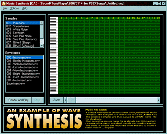



## Music Synthesis

### Description

Here's an example to demonstrate the synthesis of musical notes using pure VB code. The notes can be save to a wave file and played of course. Enjoy !!
 
### More Info
 

             |
---                |---
**Submitted On**   |2007-01-17 10:53:20
**By**             |[been\_lucky](https://github.com/Planet-Source-Code/PSCIndex/blob/master/ByAuthor/been-lucky.md)
**Level**          |Intermediate
**User Rating**    |4.8 (24 globes from 5 users)
**Compatibility**  |VB 6\.0
**Category**       |[Sound/MP3](https://github.com/Planet-Source-Code/PSCIndex/blob/master/ByCategory/sound-mp3__1-45.md)
**World**          |[Visual Basic](https://github.com/Planet-Source-Code/PSCIndex/blob/master/ByWorld/visual-basic.md)
**Archive File**   |[Music\_Synt2042801162007\.zip](https://github.com/Planet-Source-Code/been-lucky-music-synthesis__1-67637/archive/master.zip)

